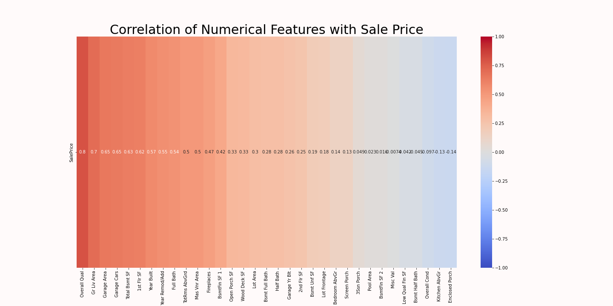

# Linear Data Housing Appraiser (LinDHA)

## Technical Note:

The ```ames-poly-engineered.csv``` contained 42,000+ columns and 2900+ rows. The resulting csv file was 425 mb which exceeded githubs max upload limit. The cells using these csv's should already be run and displayed but if you need this file for any reason, feel free to contact the author for a copy.

## Problem Statement:

The purpose of this project is to iteratively build a linear model to predict (as accurately as possible) the housing prices in Ames, Iowa from 2006 to 2010. This problem is interesting for 2 majors reasons stated below.

Firstly, from a machine learning perspective, linear models are considered rudimentary and "simple-minded". Yet there is no clear or formulaic methodology to always produce the "best" linear model. Given a training set, there should exist a theoterical "best" configuration of features and hyperparameters in the feature/hyperparameter space which produces the most accurate  linear model. Finding this configuration is a highly non-trivial computational problem.

Secondly, producing an "accurate enough" linear model can serve as a proof of concept for predicting housing prices before investing significant time and resources into production of more advance models. A servicable linear model can be a very strong indicator of the viability more sophisticated models such as multi-layered neural networks. Thus we would like to at least gain some insight into the viability of predicting housing prices before spending weeks or even months trying to engineer a more sophisticated deep learning algorithm.


The objective of this project then, is iteratively produce a linear model to acheive the lowest possible error metrics. For concreteness (and interpretability) we will use Mean Absolute Error (MAE) as our scoring metric.

<br>

## Background

A **linear model** or **linear hypothesis** is a function of the form:


for some fixed set of coefficients  which we call the **parameters**. A **linear regression problem** is a machine learning problem where we are asked to produce such a function from a given set of data values  (superscripts here denote the index). The objective is to find parameters  which produces the "best" model . Here the term "best model" is with respect to some kind of scoring metric.


The metric we use to score our model will be the **Mean Absolute Error (MAE)** defined as:

<br>


<br>

where:
-  is the number of training/test examples.
-  is the actual value of the -th example.
-  is the vector of feature/input values of the -th example.
-  is our trained model.

We chose this metric for the reason of interpretability: in the context of the problem, the MAE is, quite literally, the expected dollar amount our model's predictions will deviate from the true price. This interpretability is highly desirable especially in a business and financial setting, where decisions must be made based on the model's predictions and performance. This metric is computed against a hold-out *test* set to evaluate the model's performance on new/unseen data.

The data set we will use to build and train our model will be the 2006-2010 <a href=http://jse.amstat.org/v19n3/decock/DataDocumentation.txt > Ames, Iowa Housing Data </a>. A csv of the training data is provided in ```/data/train.csv``` in the project directory. This data set contains approximately 2050 houses with 80 features. The feature we wish to predict is thte ```SalePrice``` value; we call this the **target variable** or **output value** and reserve the term *feature* for input values exclusively. Three features will not be used under any circumstances: ```Yr Sold```, ```Mo Sold```, and ```Sale Type``` as these are features our model will not have access to before a sale has actually been made (this issue is more generally called **data leakage**). The data dictionary can be found in the hyperlink provided above.


Secondary to this is an *unlabeled* set of houses used as part of a Kaggle competition. The models built were used to generate predictions of ```SalePrice``` values for this set of houses. These predictions were then submitted to a private Kaggle competition (hosted by General Assembly).


## The ```PaulBettany``` Library and a Custom Class ```Project```

Since different models are trained on different configurations of features, one of the technical challenges for this project was organization and compartmentalization. After many iterations of a model, it became tedious and unfeasible to mentally track each model's list of input features.

To combat this situation, we wrote a custom library ```PaulBettany``` (imported as ```jarvis``` in the notebooks) consisting of various helper functions and a new custom Python class called ```Project```. A ```Project``` object was meant to act as a folder storing all the processed Pandas dataframes and the corresponding models they feed into. Most of the methods corresponding to this class involve packaging the data processing and model building pipeline into single steps.

- The 3 most important attributes of the ```Project``` class are ```Project.data``` which stores the dataframe being used, ```Project.X``` which stores a processed version of the training data, and ```Project.model``` which stores the model we are training on the data.

- ```Project.prepare_data()``` adds dummy features via ```pd.get_dummies()``` and splits the data into  ```X_train``` and ```X_test``` sets via sklearn's ```train_test_split```. The split dataframes are stored as attributes ```Project.X_train``` and ```Project.X_test```. If a ```StandardScaler()``` object is stored, it will scale the data automatically after the train-test-split step.

- ```Project.protopye()``` builds the model on the ```Project.X_train``` data

- ```Project.build_model()``` builds the model over the entire set ```Project.X```.

Various other helper functions and methods exist and we cannot hope to cover them all here in this README. However, the design philosophy was to make these functions and method names as explicit as possible, so the reader should be able to glean what the functions and methods are doing by reading their names.

**WARNING:** As of writing, the ```Project``` class is still poorly optimized and stores many redundant copies of the same dataframe. For smaller dataframes and projects this is not a big deal, but for larger data frames (such as the ones we will create for regularization), the increase in load-times and processing times is very noticeable. For this reason, we use our custom ```Project``` class only for the first 3 models where the dataframes are still relatively small.


## Summary of Methodology and Results

The model building process will consist of steps, meant to iteratively improve the sophistication of the model:

0) **Data Cleaning and EDA:** we clean the data and conduct some data exploration, focusing mainly on identifying important variables and looking out for problematic distributions and values.

<br> 

<div> 
    
<div>

<br>

1) **Base Model:** We take the numerical variables with a correlation coefficient $r>0.2$ found in the EDA step and assemble a rudimentary model called *LinDHA Mk 1*. The Mk 1 serves as the prototype model to which we add features and scale upwards. The base model results in a MAE of $ 21,365. 

2) **Feature Selection:** We manually test different configurations of features to try and find the theoretical optima in the feature space. The purpose of this step is to see how far we can get without any sophisticated manipulations or engineering. After testing various configurations, we take the best such configuration to build the Mk. 2 model. The Mk. 2 results in a MAE of $15,640.

3) **Feature Engineering:** We manually engineer features to increase the model's **capacity** (a theoretical value that measures the model's ability to learn complex hypotheses). In this step, we sum features to remove redudancies. We also create interaction terms by multiplying Area features against Quality features to try and magnify the value of high quality homes. We also try to square root the area features. The resulting Mk. 3 model scores a MAE of $13,909, 2nd best amongst our cross-validated models and the winning model for the Kaggle competition hosted by General Assembly for the DSIR-222 cohort.

4) **LASSO:** We overload the model's capacity by generating 42,000+ features via polynomials and interaction terms. We then let the model use LASSO to automatically select and purge features at it's own discretion. The number of features purged can be controlled using a hyperparameter  and the optimal  was searched for *a la* grid search. The resulting Mk. 4 model uses 522 features with a $13,565, the best amongst all models.

5) **Ridge:** Since LASSO has a tendency to underfit by overzealousy purging multi-collinear features, we try to tame some of the bias by using Ridge. The idea is to again overload the model's capacity via polynomial features and let the model use "a little bit" of each feature. Again the size of the coefficients can be controlled using a hyperparameter . The optimal  was searched for using a grid search (as with LASSO). Out of the 42,000+ features, the resulting Mk. 5 model uses approximately 25,000 features. The MAE is $15,350, worse than the Mk.4 model but still good for 3rd best amongst all models. The main issue here is that Ridge model overcompensated for the underfitting too much and now *overfits* the data.

6) **Elastic Net:** Since LASSO underfits and Ridge overfits, we try to play the two models against each other by taking their average. The resulting model is called an **Elastic Net** model and constitutes the Mk. 6 iteration of LinDHA. The balance between LASSO and Ridge can be controlled for using a pair of hyperparemters  and ; the optimal pairing was searched via grid search, but fixed search times began producing diminishing returns in performance and was eventually halted. This model scored a MAE of $15,289 which is about even with the Mk. 5 using Ridge.

7) *(Bonus)* **KNN:** Out of curiousity, the author decided to run a simple k-nearest neighbors regression model. The "smoothness" and characteristic of the learned hypothesis can be controlled for via a pair of hyperparameters:  the number of neighbors and  the choice of norm. Informally,  decides *how* many neighbors and  decides *who* is a neighbor. The optimal pairing was found via a low time-cost grid search which resulted in  neighbors using  (the Manhattan/Taxicab norm). The resulting model had a MAE of $20,800.


## Conclusions

The best score the author found was a MAE of approximately $13,500 - $14,000. Thus the average MAE across all the models is approximately 7.7% of the mean Sales Price of houses in the data set. LinDHA tends to perform very well for houses from $100,000 - $400,000. After this range, the errors in prediction become more volatile and should viewed with an air of caution. It seems that housing prices can be modeled, to a degree, using a linear model such as LinDHA and the author believes that it is viable and worth investing time in the development of a more sophisticated model to drive down MAE even more.

We would also like to mention various possible routes to take for improving LinDHA, inspired by the works of others on this data set. Let us end on a message of possibility and imagination:

- Wonki Lee implemented a very clever technique for imputing missing/null values using KNN. We think this implementation can be used to fill in missing values for the Lot Frontage feature. It is worth trying this to see if we can shave MAE down a few more ticks.

- Marshall Cyrus used a Recursive Feature Elimination with Cross-Validation (RFECV) algorithm in the ```sklearn.feature_selection``` library. Our understanding of this algorithm is that it functions analogous to LASSO where lower coefficient terms are removed systematically and until an optimal configuration is found. This may serve as a viable replacement for LASSO when the set of features is low or when we want to quickly remove multi-colinear features. Since we had good success manually selecting and engineering a low number of features, this process might provide a more systematic and refined way of tuning the model.

- The author hypothesizes that a **target/mean encoding** scheme of the categorical variables can potentially improve the performance of the LASSO model. Target enconding essentially replaces a class in a categorical feature with the mean value of the target variable in the class. Such an encoding generally causes overfitting, which might work to our advantage by cancelling out some of the underfitting from LASSO. Further testing is necessary here. 